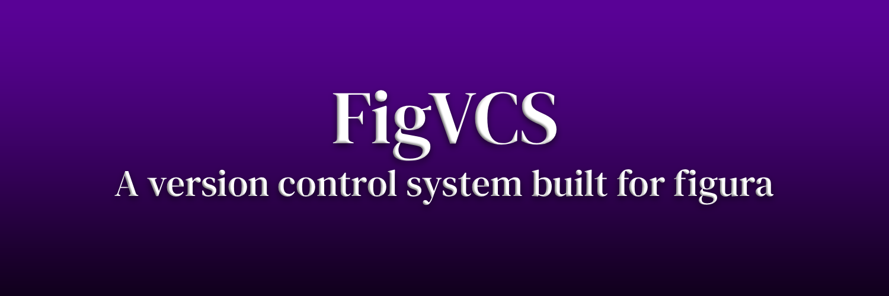

[![CC BY-NC-SA 4.0][cc-by-nc-sa-shield]][cc-by-nc-sa]

# What is FigVCS anyway?
FigVCS is a (VCS) Version Control System built specifically for managing [FiguraMC](https://github.com/FiguraMC/Figura) avatars.

## Plans for this project
- Establish a system that is low on storage usage but effective.
- Establish an efficient system so that if a hub is created for avatars the local versioned repos can be uploaded with ease.
- Add easy library linking to have libraries update automatically with something like `fvcs pull`
- Eventually a Desktop GUI with Linux and Windows support(Possibly even MacOS support) since I know not everyone prefers CLI
- A Minecraft Companion mod for FigVCS that allows for dynamically saving versions of avatars and managing versions within [FiguraMC](https://github.com/FiguraMC/Figura)

## Copyright

This work is licensed under a
[Creative Commons Attribution-NonCommercial-ShareAlike 4.0 International License][cc-by-nc-sa]. In other words you **may** share and modify the source code, however you may **not** use the code for commercial purposes, you must distribute your contributions under the same license as the original, you may not apply legal terms or [technological measures](https://creativecommons.org/licenses/by-nc-sa/4.0/#ref-technological-measures) that legally restrict others from doing anything the license permits, and you may not use the code without giving [proper credit to me](https://creativecommons.org/licenses/by-nc-sa/4.0/#ref-appropriate-credit), you must indicate if changes were made. You may do so in any reasonable manner, but not in any way that suggests that I endorse you or your use. For more details please [read the page on creativecommons.org](https://creativecommons.org/licenses/by-nc-sa/4.0/) 

[cc-by-nc-sa]: http://creativecommons.org/licenses/by-nc-sa/4.0/
[cc-by-nc-sa-shield]: https://img.shields.io/badge/License-CC%20BY--NC--SA%204.0-lightgrey.svg
